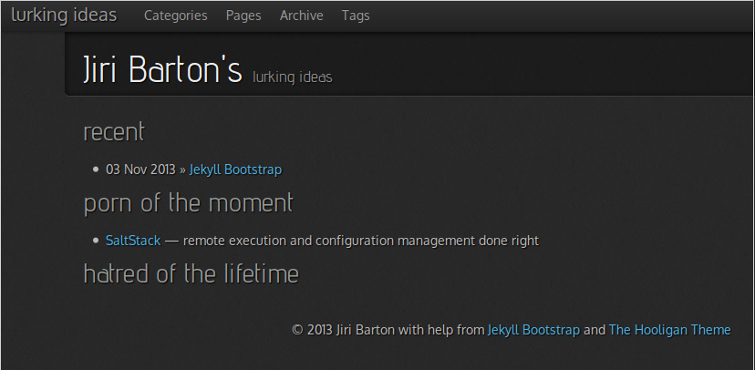



Screw it! [Jekyll Bootstrap](http://jekyllbootstrap.com) to write content 
instead of blogging about writing a blog. [Github](http://github.com) to host 
the result -- which is a collection of static pages!

Now to customize styles a bit and find out how to embed images and specify 
permalinks.

Obstacles
=========

Not so fast! Why could not I see this post at first?

### 1. A Post? How?

Oh okay,

    rake page name="Jekyll-Bootstrap.md"

filled in some content, went to http://localhost:4000, but where is it? 
Aaaaw, it has to go to `_posts/` and has to follow the naming `Y-M-D-title.md`.

    mv Jekyll-Bootstrap.md _posts/2013-11-03-Jekyll-Bootstrap.md

There you go. It is in the list `Here’s a sample “posts list”.` Good!

### 2. The front page

It is all in `index.md`. Switched the theme following with

    rake theme:install git="https://github.com/dhulihan/hooligan.git"

and it worked. It looks much better now. Going to start writing soon but 
first, to sort out permalinks and images.

### 3. Light adjustments

Tried

    permalink: jekyll-bootstrap

in the header and it worked. V. good.

Let me see how others link it. Put them to `images/`. Okay:

### 4. Theme again

Switched themes again. `hooligan` looked more like a ransom letter with more 
text. I am not sure I like the spacing in `mark-reid` but I may adjust it later.
