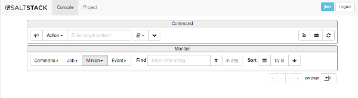
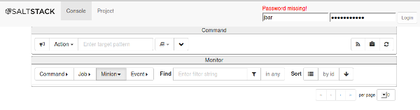
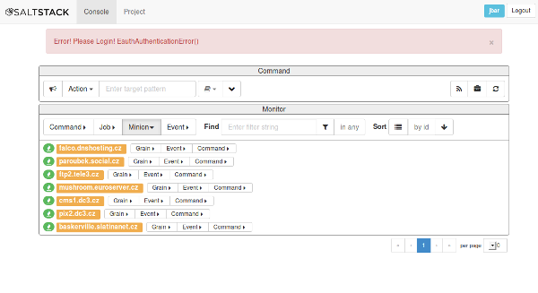
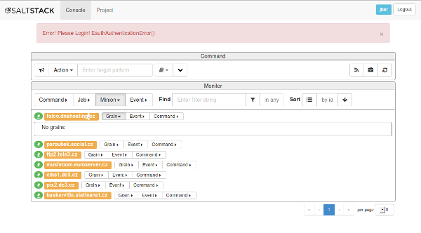
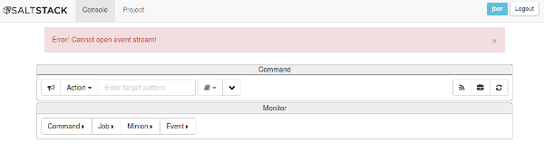



I use [Salt](http://salstack.org) a lot and so my colleagues. We usually log 
in to the salt master and run salt from its command line. You can see its 
output immediately on the screen. The output can be customized in many ways. 
Salt keeps a history and you can inspect it to find out what was run and when 
and what its result was.

##Salt GUI

Somehow and more often, I feel this is not enough. I want to glance at a 
screen and see what tasks were run recently and what their results were. I 
just feel I want to use a browser for this -- browsing. Click the details and 
see how long the command took. When was it finished. Are there any scheduled 
tasks? When did they run?

I am really looking for a GUI. Something I can show to my other coworkers who 
are not savvy for the command line. Let them run a task with a push of a button.

##Halite

[SaltStack, Inc.](http://saltstack.com) the company behind Salt has been 
developing something like this for quite a while. Their GUI is called 
[Halite](http://github.com/saltstack/halite). I checked it out quite a while ago 
and it was in a very early stage of development. Let us find how ready it is now.

###Configuration

You have to configure its server in your master salt file:

    halite:
      level: 'debug'
      server: 'gevent'
      host: '127.0.0.1'
      port: '8001'
      cors: False
      tls: False

Now you can point your browser to http://localhost:8001. You will find out 
you need to authenticate first to be able to see something. 

###Authentication

This was my first annoyance. One can easily hide it behind a web server and the 
HTTP auth, don't they? Well, okay. The documentation offers only one 
convenient way to continue: using PAM. No password file or password-less 
access is supported. I used my local username and put it to the master salt file:

    external_auth:
      pam:
        jbar:
          - .*
            
-><-

Really, autocomplete broken?

###Minions

7!

The tab loaded like seven minions even though I am pretty sure there are more 
than seventy at the moment. No, wait, there is more. No progress bar the GUI is
still loading data.

No grains? What? I am waiting patiently. Nothing. Actually, one of the icons on the 
right at the top refreshes the grains. Well, it refreshes all grains for all 
minions and it takes really long. No progress bar here either.

Interestingly, logging out and in again loses this information.

###Events

Again? 

##Stop

I do not want to go on. Halite may be a terrific GUI once it is finished. It 
is far from it now. It seems slow, not responsive, and frustrating. Some 
features are not implemented but it does not say so or, are buggy or not working.

I have to look another way. I was thinking about **having returners push data 
to an external database (Logstash) and displaying it with other means 
(Kibana)**. Keep in touch for this next find.

